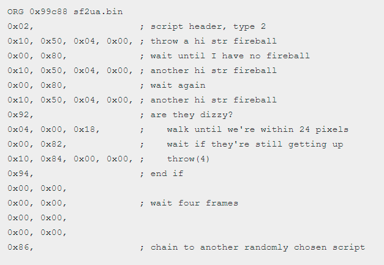

**_INTELIGENCIA ARTIFICIAL PARA VIDEOJUEGOS_**  
Integrado por:
- Tatiana Duarte Balvís
- Adrián de Lucas Gómez
  

# __FightIA__
## **_IA para practicar en juegos de pelea_ 🤜🏻💥👄🦷**

 

## __Introducción__

FightIA es un proyecto planteado como un juego con una Inteligencia Artificial simple para iniciarse en los juegos de pelea y poder mejorar tus estrategias como jugador. Para ello, hemos realizado una labor de investigación sobre cómo se desarrollan las IA en este tipo de juegos y nos hemos basado en grandes clásicos y referentes del género, como Street Fighter II, que a pesar de no contar con una IA demasiado compleja como es el caso de los juegos actuales, alcanzó gran fama mundial debido a otros factores como los moveset y combos.

 

## __¿Cómo suelen hacerse las IAs para este tipo de juegos?__

Para hacer la inteligencia artificial de este género de videojuegos se suele optar por un enfoque que hace que la IA “vea” lo que ocurre en pantalla como lo haría un humano. Podría ver la posición de los personajes, la vida que tiene cada uno, el tiempo que queda y ver qué acción está realizando el contrincante.
A esta “visión” se la denomina como **espacio de observación** y hay dos formas de implementarlo:

- **La clásica**: poner toda esa información en coordenadas y datos que la IA pueda entender.
- **La moderna**: realizando una captura tras cada acción y dejar que sea la propia IA la que analice lo que ocurre en esa imagen y determine cómo debe responder a ello.

Nuestra IA está basada en el modelo clásico ya que queríamos que fuera más similar a lo que se podría haber hecho en la época del Street Fighter 2. Cabe destacar que el modelo moderno es considerado mejor ya que trabaja de una forma más similar a como lo haría una persona siendo obviamente más realista pero por contraparte esto lleva mucho más tiempo de entrenamiento para perfeccionarlo.  
En conjunción a esta técnica se suele usar el **Machine Learning** para que tras cientos o miles de partidas la IA identifique patrones de cómo juegan los jugadores para así saber reaccionar mejor a las diferentes estrategias que se le planteen.

 

## __Street Fighter II como referente__

Hoy en día diríamos que la Inteligencia Artificial en **Street Fighter II** no es nada muy sofisticado, ya que normalmente cuando se habla de IA mucha gente piensa en el **Machine Learning** mencionado anteriormente. Sin embargo, no existe nada como eso en SF2 y otros juegos de la época.

 

   

Los personajes de SF2 no realizan movimientos y acciones de forma independiente, sino que estos se agrupan en pequeños scripts escritos en “lenguaje máquina” englobándose así en rutinas. Por ejemplo, una rutina típica de ataques de un personaje será una lista de acciones como atacar, esperar, moverse y otras acciones dependientes del estado del jugador.

Esta IA actúa de tres formas distintas:  
- <i>Esperar a ser atacada</i>: Se eligen scripts de forma aleatoria, priorizando movimiento hacia delante y detrás pequeñas distancias.
- <i>Atacar</i>: Se elige un script de rutina de ataque como el de la captura anterior.
- <i>Reaccionar a un ataque</i>: Se eligen scripts adecuados para evitar y esquivar el ataque dependiendo también de la dificultad para dar margen de error.

 

## __Estrategias comunes en una partida__

Cada jugador tiene su estrategia y su forma propia de jugar en los juegos de pelea. Estas estrategias se pueden agrupar en cuatro categorías que podemos usar de ejemplo a la hora de programar una IA para diferenciarla de otras y darle un aspecto más humano a la hora de elegir movimientos y ataques:

- **Rushdowns**: Ataques constantes a corta distancia. Es una forma de jugar agresiva para confundir al contrincante y que no tenga mucho tiempo para pensar, lo que lo hará fallar más a menudo y favorecer al jugador.
- **Footsies**: Mucho movimiento de adelante a atrás midiendo distancias con el objetivo de encontrar un hueco o momento oportuno para atacar.
- **Zoning**: Ataques a larga distancia para mantenerse lejos del contrincante, evitando así muchas posibilidades de ser atacado.
- **Setups**: Preparar el terreno para encontrar el mejor momento para realizar una serie de ataques o combos.

 

## __Desarrollo del proyecto__

Para el desarrollo de este proyecto de investigación sobre la IA en los juegos de pelea hemos desarrollado un prototipo en Unity en el cual se ha implementado una inteligencia artificial que controla al esqueleto mientras que el jugador controla a la chica. Se ha implementado todo a base de scripts ya que el objetivo era hacer una IA al estilo más clásico, por lo que el uso de Bolt y Behaviour Designer no estaba en nuestros planes.

Para nuestra IA queríamos que siguiera el modelo clásico por análisis de datos codificados, pero que tuviera implementadas ciertas estrategias que la hagan parecer más humana y más estratégica. Las estrategias que decidimos integrar son **Footsies** y **Zoning** ya que creemos que son comportamientos muy típicos de una persona que juega de una forma más defensiva. Ese tipo de estrategia sumado a la toma de decisiones de la inteligencia artificial que tienden, si la situación lo permite, a ser ofensiva, da como resultado una IA relativamente equilibrada, similar a lo que sería un jugador promedio siendo apta para distintos tipos de jugadores.

 

## __Funcionamiento de FightIA__
Como base hemos separado el movimiento del personaje y las acciones que podemos realizar para asemejarse a como lo haría una persona con un mando, es decir, usando una mano para mover al personaje y la otra para dar los comandos de acción. Para ello tenemos dos métodos, SigienteMovimiento y SiguienteAcción que se encargan de procesar el estado actual y actuar en consecuencia de la mejor forma posible. Ambos son llamados por temporizadores independientes para simular el tiempo que una persona tarda en pensar su siguiente movimiento.

- **SiguienteMovimiento**: Mantiene la IA a una distancia prudente del jugador. Teniendo en cuenta la distancia que los separa, intenta no estar muy cerca constantemente para evitar ser atacada y también no alejarse demasiado para poder actuar más rápido. Si está a una distancia “normal” del jugador, se mantiene en movimiento (estrategia **Footsies**). Las distancias mínima y máxima que considera como prudentes se pueden modificar desde el editor de Unity para realizar pruebas.
Los movimientos posibles entre los que decidir no son muchos al tratarse de un juego en 2D: acercarse, alejarse o mantenerse quieto.

- **SiguienteAcción**: Según el estado en el que se encuentra el enemigo y teniendo en cuenta parámetros como la posición de los personajes, la distancia y la vida de cada uno se calcula cual es la orden más óptima a dar en cada situación, pero para meter un poco de variación y error “humano” estas órdenes estarán influenciadas por una probabilidad y porcentajes de que se haga una acción u otra dándole mayor porcentaje a la acción más óptima para esa situación. Tras gran cantidad de pruebas y evaluaciones se han llegado a los porcentajes que se han usado finalmente, ya que ofrecen la experiencia más equilibrada entre dificultad y satisfacción.
Las acciones posibles que puede realizar son: agacharse, levantarse, saltar, atacar hacia arriba, atacar hacia el centro, atacar hacia abajo, protegerse o no hacer nada.

Tras esta toma de decisiones se llama a los métodos correspondientes que se encargan de ejecutar las instrucciones dadas, tanto de movimiento como de acción.

 

## __Explicación de los scripts implementados__

- **GameManager** Controla parámetros comunes a ambos jugadores como el tiempo de la partida y si la partida sigue en juego o ha acabado. También permite que los “controller” obtengan información del contrario pero únicamente de lectura como su posición o la vida. Puede ajustar la orientación de los personajes en el caso de que se hayan cruzado y determinar quién debe de ganar la partida ya sea porque el tiempo se ha agotado o uno de los contrincantes ha acabado KO.
 

- **FightingController:**  Clase de la que heredan tanto PlayerController como EnemyAI la cual cuenta con variables de estado (quieto, saltando, agachado...), métodos de interfaz que implementarán las clases que derivan de ella, array de sonidos para los movimientos y variables de configuración.
 

- **PlayerController:** Script para que una persona pueda controlar al jugador usando A y D para el movimiento horizontal, W para saltar y S para agacharse. Para atacar se usan J, K y L para ataque alto, medio y bajo respectivamente reservándose la I para protegernos.
 

- **EnemyAI:** Script que controla de forma autónoma al enemigo y el cual actúa según el estado de la partida y de que esté haciendo el jugador tomando decisiones sobre movimiento y acciones a realizar basándose en un sistema de porcentajes con diferentes posibilidades.
 

- **Timer:** Gestiona y dibuja en pantalla con el formato correcto el tiempo que queda de partida permitiendo al GameManager consultarlo para ver si se ha agotado el tiempo.
 

- **BarraVida:** Se encarga de gestionar la vida del jugador y de actualizar la interfaz para reflejar el estado. Para dar un mejor aspecto se han añadido sistemas de partículas para que sea visualmente más evidente cuando pierde vida uno de los luchadores.
 

- **AtaqueAcertado:** Script asociado a las hitbox de los ataques que se encargan de comprobar si han colisionado con uno de los luchadores y según sea uno u otro llama a su método GestionaDaño para que aplique el daño oportuno según el jugador esté cubierto o no.

 

## __Pruebas realizadas__

- **Protegerse si está cerca**

  

- **Atacar hacia arriba si el contrincante está en el aire**

  

- **Atacar si está en rango**

  

- **Saltar si el otro salta (Mantener misma altura)**

  

- **Alejarse si está cerca**
[Vídeo demo](https://drive.google.com/file/d/1zjak_4D0Re-VioP9UHJNAunYUbKRHFmv/view?usp=sharing)
 

- **Daño reducido si está protegido** [Vídeo demo](https://drive.google.com/file/d/1zjak_4D0Re-VioP9UHJNAunYUbKRHFmv/view?usp=sharing)
- **Acercarse si está lejos** [Vídeo demo](https://drive.google.com/file/d/1zjak_4D0Re-VioP9UHJNAunYUbKRHFmv/view?usp=sharing)
- **Gana si derrota al jugador** [Vídeo demo](https://drive.google.com/file/d/1zjak_4D0Re-VioP9UHJNAunYUbKRHFmv/view?usp=sharing)
- **Pierde si el jugador le derrota** [Vídeo demo](https://drive.google.com/file/d/1zjak_4D0Re-VioP9UHJNAunYUbKRHFmv/view?usp=sharing)
- **Empata si el tiempo se agota y tienen la misma vida** [Vídeo demo](https://drive.google.com/file/d/1zjak_4D0Re-VioP9UHJNAunYUbKRHFmv/view?usp=sharing)

 

## __Otros elementos del proyecto__

- Desde el editor de Unity se ofrecen gran cantidad de parámetros modificables para desarrolladores que permiten cambiar cómo se desarrolla la partida y la dificultad de la IA.

- Hemos agregado un **botón para reiniciar** la escena, de tal forma que ayuda a la hora de realizar pruebas de funcionalidad o por si se produjera cualquier error.

- Hemos agregado un **botón para salir** de la build del juego.

- Hemos añadido modelos y decorados para dar un mejor aspecto al prototipo y aportarle personalidad propia, además de servir de feedback visual (por ejemplo: se muestra un escudo al protegerse).

- Las barras de vida son dinámicas y bajan su valor gradualmente dando un aspecto progresivo y no tan seco.

- Hemos añadido música de fondo y sonidos para dar feedback extras a las acciones e interacciones que ocurren en el juego.

 

## __Lugares de consulta__

- https://medium.com/gyroscopesoftware/how-we-built-an-ai-to-play-street-fighter-ii-can-you-beat-it-9542ba43f02b
- https://sf2platinum.wordpress.com/2017/01/20/the-ai-engine/
- https://intellipaat.com/community/3628/how-to-design-the-artificial-intelligence-of-a-fighting-game-street-fighter-or-soul-cali-bur
- https://www.reddit.com/r/gamemaker/comments/c9khem/fighting_game_ai/
- https://www.reddit.com/r/Skullgirls/comments/82xdf6/skullgirls_ai_teaching_a_machine_to_fight/
- https://forum.unity.com/threads/fighting-game-ai.241597/